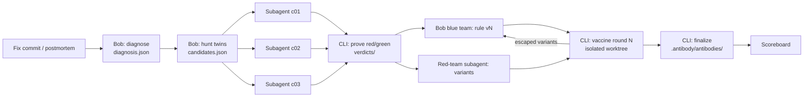

# 🧬 Antibody

**Your team already paid for every bug. Antibody makes sure you never pay twice.**

Antibody is an immune system for your repository, built on **IBM Bob 2.0**.
When your team fixes a bug, Antibody finds every other place where the same
mistake still lives, **proves each one with a failing test**, fixes them, and
leaves a permanent defense that Bob **attacks itself** until it catches every
realistic variant of the bug.

> Built for the IBM Bob 2.0 Hackathon (lablab.ai, September 2026).
> Demo video: `<link>` · Bob session evidence: [`bob_sessions/`](bob_sessions/)

---

## The problem

When a developer fixes a bug, they fix **one copy** of it. Almost nobody asks
where else the team made the same mistake: searching by hand is slow, and
`grep` cannot find the same mistake written a different way. So the bug comes
back weeks later, in another file, with another symptom, and someone pays for
the diagnosis all over again.

- **Repeated bugs:** the team pays several times for the same mistake.
- **Generic defenses:** linters ship universal rules; they do not know *your* mistakes.
- **Lost knowledge:** the "why" behind a fix lives in one person's head.

## What Antibody does

Antibody runs in four phases, like an immune response.

| Phase | What happens | Who does it |
|---|---|---|
| **1. Infection** | Reads the fix diff, commit message and linked issue (or a postmortem) and extracts the **abstract root cause**: the mistake, not the location. | Bob |
| **2. Antibodies** | Searches the whole repo **by meaning** for twins. One subagent per candidate writes a test; a twin is confirmed **only if the test fails**. Confirmed twins get a minimal fix and turn green. | Bob + CLI evidence |
| **3. Vaccine** | Bob writes a Semgrep rule, then a separate **red-team subagent that never sees the rule** attacks it with realistic variants of the bug, in an isolated worktree. Escaped variants make Bob harden the rule, round after round. | Bob + CLI evidence |
| **4. Memory** | The rule's message tells future developers what happened last time and links the original fix. Everything is stored in the repo under `.antibody/`. | Bob + CLI |

### Immunity Score

```
Immunity Score = variants caught by the defenses / valid variants
```

Round 0 measures the defenses your repo **already had** (existing tests, no
rule). Each later round measures the rule Bob wrote. The score is computed by
the CLI from real Semgrep and test executions, never estimated by the model.

### Proof over opinion

Antibody never reports a twin it cannot demonstrate. Bob writes the tests; the
**CLI runs them and records the evidence** (`recorded_by: antibody-cli`). A test
that fails because of an import or syntax error is not a proof. Candidates that
cannot be tested are shown separately as *suspected*.

---

## How Antibody uses IBM Bob

Antibody is a **custom Bob mode** with five skills, one per phase. Bob is the
brain of every step; the CLI only runs the deterministic parts.

| Bob capability | Where Antibody needs it |
|---|---|
| **Document understanding** | Reading the fix diff, the issue and postmortems (Markdown, PDF, DOCX) to extract the root cause. |
| **Full repository context** | Finding the same mistake written differently across the whole codebase, which text search cannot do. |
| **Subagents and parallel tasks** | One subagent per candidate proves its twin in isolation; a red-team subagent writes the attacks without seeing the defense. |
| **Agent mode** | The full loop from a fix commit to a hardened, self-tested rule, pausing only for human approval. |



More detail: [docs/ARCHITECTURE.md](docs/ARCHITECTURE.md) and
[docs/CONTRACTS.md](docs/CONTRACTS.md).

---

## Quickstart

Requirements: Python 3.10+, git, [IBM Bob IDE](https://bob.ibm.com) 2.0.2 or
later, and in the target project: `pytest` and `semgrep`.

```bash
# 1. Install the CLI
git clone <this-repo> antibody && cd antibody
pip install -e ".[tools]"

# 2. Prepare the target repository
cd /path/to/your-project
antibody init            # creates .antibody/ and installs the Bob mode in .bob/
```

3. Open the project in **Bob IDE**, select the **🧬 Antibody** mode and run:

```
/antibody <fix-commit-sha>
```

Bob walks through the four phases and pauses for your approval before
changing production code, committing or finalizing.

4. See the result:

```bash
antibody status
antibody scoreboard --repo-label owner/project
python -m http.server 8000   # from the Antibody repo root
# open http://localhost:8000/ui/scoreboard.html and load .antibody/runs/<id>/scoreboard.json
```

The scoreboard opens with example data if no file is loaded. Use **Replay run**
to animate a run from its recorded evidence.

---

## CLI reference

| Command | What it does |
|---|---|
| `antibody init` | Create `.antibody/` and install the Bob mode into `.bob/` |
| `antibody new --commit <sha>` | Start a run from a fix commit (or `--document <path>` for a postmortem) |
| `antibody validate <file> --schema <name>` | Check a JSON file against its contract |
| `antibody prove <cid> --test <file> --phase red\|green` | Run a twin's test and record evidence |
| `antibody mark <cid> --suspected\|--rejected --reason "..."` | Classify a candidate that cannot be proven |
| `antibody vaccine --round N [--rule <file>]` | Attack the defenses with every variant, compute the Immunity Score |
| `antibody finalize --slug <name> --rule <file>` | Create the permanent antibody |
| `antibody scoreboard` | Build `scoreboard.json` for the UI |
| `antibody baseline --minutes M --twins N` | Record the manual search baseline for ROI |
| `antibody status` | Show the state of a run |

Budgets live in `.antibody/config.json` (`max_candidates`, `max_variants`,
`max_vaccine_rounds`) so Bob usage stays predictable. The test command is
configurable for projects that run tests through `uv`, `poetry` or `tox`.

## What stays in your repo

```
.bob/                                 the Antibody mode, rules, skills, /antibody command
.antibody/
  config.json                         budgets and test command
  runs/<run_id>/                      every step of every run, with evidence
  antibodies/001-naive-vs-aware-datetime/
    rule.yml                          the hardened Semgrep rule, message = memory
    manifest.json                     root cause, twins, immunity per round
    history.md                        human-readable story of the antibody
tests/antibody/                       the regression tests that proved each twin
```

No server, no database, no dashboard to host. Everything is reviewed as code.

---

## Results

Measured by the team on the demo repository (see [docs/team/DEMO.md](docs/team/DEMO.md)).

| Metric | By hand | Antibody |
|---|---|---|
| Time to search for twins | `__ min` | `__ min` |
| Twins found | `__` | `__` (all proven with a failing test) |
| Immunity before / after | n/a | `__%` → `__%` |
| Backtest: later bug prevented | n/a | `yes/no, commit ____` |

## Repository layout

```
antibody/            Python package: CLI, evidence runner, vaccine engine, schemas
antibody/bob_template/bob/   the Bob mode installed by `antibody init`
ui/scoreboard.html   the visual scoreboard used in the demo
examples/sample-run/ a complete example run (contract reference for every workstream)
tests/               tests for the CLI (run: python -m unittest discover -s tests)
docs/                architecture, contracts and team plans
bob_sessions/        IBM Bob task session summary screenshots (hackathon evidence)
```

## Limitations

- Works best for mistakes that a unit test can demonstrate (logic errors, API
  misuse). Concurrency and infrastructure bugs usually end up as *suspected*.
- The first version targets Python projects with pytest and Semgrep. The test
  command is configurable; other languages need their own skills tuning.
- Antibody proposes; humans approve. It never merges or pushes.

## Data and privacy

The demo uses public open-source code under licenses that allow commercial use.
All sources are listed in [DATA_SOURCES.md](DATA_SOURCES.md). Antibody files
never store author names or emails from git history.

## Team

`<names and roles>`

## License

MIT, see [LICENSE](LICENSE).
