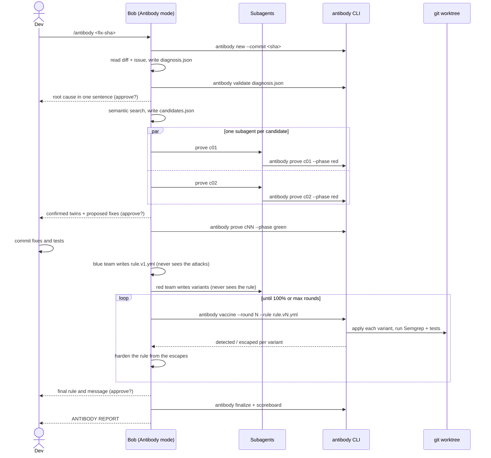

# Architecture

## Design principles

1. **Bob thinks, the CLI executes.** Reasoning (root cause, semantic search,
   writing tests, fixes, variants and rules) is Bob's job inside the Antibody
   custom mode. Anything deterministic (running tests, running Semgrep,
   applying patches, computing scores) is the CLI's job. This keeps evidence
   trustworthy and saves Bobcoins: Bob never spends tokens simulating a test run.
2. **Proof over opinion.** A twin is confirmed only by a test that ran and
   failed, read by the CLI from the test runner's JUnit report (or from pytest's
   exit codes when no report is configured).
3. **Isolation.** Vaccine variants are applied in a temporary `git worktree`,
   never in the developer's checkout.
4. **Everything lives in the repo.** No server, no database. Runs and
   antibodies are plain files under `.antibody/`, reviewed like code.
5. **Human in control.** Bob pauses for approval before changing production
   code, before commits and before finalizing an antibody.
6. **Budgets are explicit.** `.antibody/config.json` caps candidates, variants
   and rounds, which caps subagent spawns.

## Components

| Component | Location | Responsibility |
|---|---|---|
| Antibody mode | `antibody/bob_template/bob/custom_modes.yaml` | Persona, tool groups, when to use |
| Mode rules | `antibody/bob_template/bob/rules-antibody/` | Principles, pipeline, reporting format |
| Skills | `antibody/bob_template/bob/skills/antibody-*/` | One instruction set per phase |
| Slash command | `antibody/bob_template/bob/commands/antibody.md` | `/antibody <sha>` entry point |
| CLI | `antibody/cli.py` | Commands Bob and humans call |
| Test runners | `antibody/runners.py` | Profiles per language, runs tests, reads JUnit reports |
| Evidence | `antibody/prove.py` | Records red/green evidence for a candidate |
| Vaccine engine | `antibody/vaccine.py` | Worktree, patches, Semgrep, tests, score |
| Memory | `antibody/memory.py` | Permanent antibody, history, scoreboard data |
| Contracts | `antibody/schemas/*.schema.json` | JSON Schema for every file exchanged |
| Scoreboard | `ui/scoreboard.html` | Visual replay of a run for demos and reviews |

## Sequence of one run

## Why a custom mode and not a backend

Bob IDE is the required core of the hackathon, and Bob 2.0 exposes exactly the
building blocks this workflow needs: custom modes with tool permissions, mode
rules, skills, slash commands and subagents. Building Antibody as a mode means
the product *is* a Bob workflow that any team can install with one command and
review in a pull request, instead of a service that calls a model.

Bob Shell could later run the same mode non-interactively in CI (for example,
on every merged PR labeled `bug`). That is out of scope for the hackathon MVP.

## Evidence integrity

- Verdict and vaccine files carry `recorded_by: "antibody-cli"` and timestamps.
- Red evidence requires the target test to appear in the runner's JUnit report
  as failed. A test that passed means the bug was not shown. No report, a test
  missing from it, only skipped tests, or a file that failed to load (Vitest
  reports import errors as a test named after the file) mean the test is broken.
  Exit codes alone are not trusted: Jest, Maven or dotnet exit 1 both for a
  failing test and for code that does not compile.
- Reports are written to a fresh path per run; for runners that write to a fixed
  folder (Maven, Gradle), reports older than the run are ignored.
- Without a report (no profile, or a custom `test_command` without
  `test_report`), pytest exit codes apply: 1 is a failure, 0 a pass, 2 to 5 broken.
- Tests inside the vaccine worktree run with `PYTHONPATH` pointing at the worktree,
  so an editable install of the main checkout cannot shadow the patched code.
  Untracked dependency folders (`node_modules`, `vendor`) are linked into the
  worktree, never copied, and the links are removed before the worktree is.
- Vaccine rounds refuse to run on a dirty tree (fixes and tests must be
  committed) and record the SHA-256 of the rule used.
- Variants that break the test run itself are marked `invalid` and excluded
  from the score, so unrealistic attacks cannot inflate or deflate it.
- The rule (blue team) and the variants (red team subagent) are written
  separately: the red team never reads the rule, and the first rule is written
  before any variant exists. A rule tailored to known attacks would score 100%
  by construction and prove nothing.

## Extension points

- **Other languages:** a new entry in `PROFILES` (`antibody/runners.py`) with the
  runner's command and where it writes its JUnit report. Any key can also be
  overridden per project in `.antibody/config.json`. Mark it `verified` only
  after running it end to end against the real runner.
- **CI guard:** `examples/ci/antibody-guard.yml` runs every antibody rule on
  each pull request.
- **Backtest:** run Antibody on an old fix and check whether it would have found
  a bug that was fixed later (see `docs/team/DEMO.md`).
