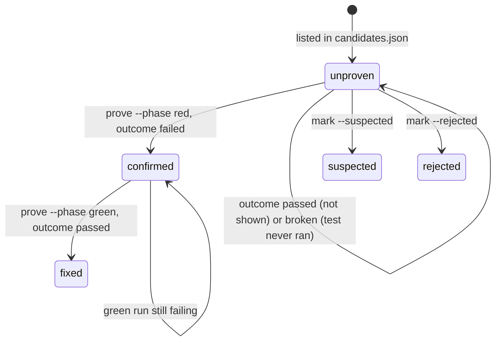

# Contracts

Every file exchanged between Bob and the CLI has a JSON Schema in
`antibody/schemas/`. A complete example of every file lives in
`examples/sample-run/`, and `tests/test_pipeline.py` validates it, so the
examples can never drift from the schemas.

Validate any file with:

```bash
antibody validate <file> --schema <name>
```

## Who writes what

| File (inside `.antibody/runs/<run_id>/`) | Schema | Written by | Read by |
|---|---|---|---|
| `run.json` | internal | CLI (`new`, every event) | CLI, scoreboard |
| `diagnosis.json` | `diagnosis` | Bob, skill `antibody-diagnose` | Bob, CLI (`finalize`, `scoreboard`) |
| `candidates.json` | `candidates` | Bob, skill `antibody-twins` | Bob, CLI (`prove`, `scoreboard`) |
| `verdicts/<cid>.json` | `verdict` | **CLI only** (`prove`, `mark`) | Bob, CLI |
| `variants.json` + `variants/<vid>.patch` | `variants` | Bob, skill `antibody-vaccine` | CLI (`vaccine`) |
| `rule.v<N>.yml` | Semgrep rule | Bob, skills `antibody-vaccine` and `antibody-memory` | CLI (`vaccine`, `finalize`) |
| `vaccine/round_<N>.json` | `vaccine_round` | **CLI only** (`vaccine`) | Bob, CLI |
| `scoreboard.json` | `scoreboard` | CLI (`scoreboard`) | `ui/scoreboard.html` |

| File (inside `.antibody/antibodies/<NNN-slug>/`) | Schema | Written by |
|---|---|---|
| `manifest.json` | `manifest` | CLI (`finalize`) |
| `rule.yml` | Semgrep rule | copied by CLI from the final `rule.vN.yml` |
| `history.md` | Markdown | CLI (`finalize`) |

## Candidate lifecycle



Only `confirmed` and `fixed` count as twins anywhere (reports, manifest,
scoreboard headline).

Red and green evidence record the `outcome` (`failed`, `passed` or `broken`),
where it came from (`evidence_from`: `junit_report` or `exit_code`), the
matching `tests_run` and `tests_failed` from the report, and a `detail` line
explaining the outcome. These fields are optional so older runs stay valid.

## Vaccine results

| Status | Meaning | Counts in score |
|---|---|---|
| `detected` | Semgrep matched the target file, or the tests ran and failed, or both | yes, as caught |
| `escaped` | The patch applied, tests passed and the rule did not match | yes, as missed |
| `invalid` | The patch does not apply, or it breaks the test run itself (outcome broken) | no |

`score = detected / (detected + escaped)`, recorded with 4 decimals.

## Identifiers

- Candidates: `c01`, `c02`, ... (regex `^c[0-9]{2,}$`)
- Variants: `v01`, `v02`, ... (regex `^v[0-9]{2,}$`)
- Antibodies: `001`, `002`, ... plus a kebab-case slug naming the mistake
- Runs: timestamp `YYYYMMDD-HHMMSS`

## Changing a contract

1. Edit the schema in `antibody/schemas/`.
2. Update `examples/sample-run/` so it matches.
3. Update the skills that write the file (`antibody/bob_template/bob/skills/`).
4. Run `python -m unittest discover -s tests`.
5. Tell the other workstreams in the team channel: contract changes are the
   only thing that can break parallel work.
